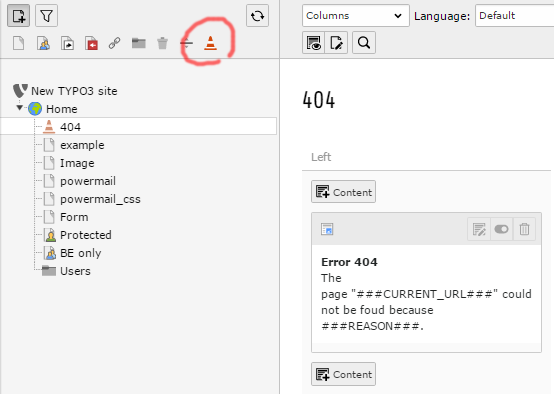
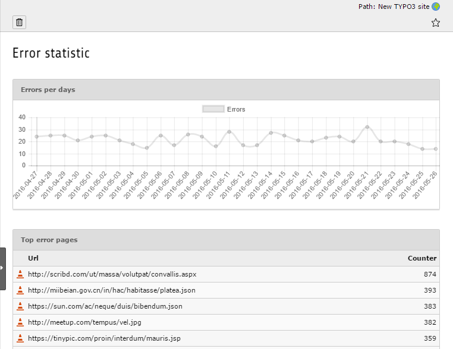

.. ==================================================
.. FOR YOUR INFORMATION
.. --------------------------------------------------
.. -*- coding: utf-8 -*- with BOM.

.. _start:

.. image:: https://travis-ci.org/r3h6/TYPO3.EXT.error404page.svg?branch=feature%2F403
    :target: https://travis-ci.org/r3h6/TYPO3.EXT.error404page

=============
Documentation
=============

Custom error 404 pages made simple. Use TYPO3 pages for display error documents. Works for multi domain and multilingual installations.

This extension adds a new custom page type for rendering 404 documents.

Screenshots
-----------

Installation
------------

Through `TER <https://typo3.org/extensions/repository/view/error404page/>`_ or with `composer <https://composer.typo3.org/satis.html#!/error404page>`_ (typo3-ter/error404page).

Integration
-----------

Simply install the extension and create a new page with your error message.

* No TypoScript setup to include.

You can use following markers in your content.

:###CURRENT_URL###: The url of the called page.
:###REASON###: A text why the error occured.

If you like redirect non logged in users on an 403 (forbidden) error,
simply include the available "Page TSConfig" or define by yourself:

``tx_error404page.redirectError403To = auto|url|uid``

Configuration
-------------

* You can enable the error log and statistic backend modul in the extension configuration.
* If required, you can change the page type in the extension configuration.

.. warning::

   If you change the page type, you must update the doktype of your previously created error pages by yourself.

Log and statistic
-----------------

If log is enabled, the last 10'000 errors are logged and listed in the backend modul "Error statistic".

FAQ
---

How it works?
   The error handler makes a request to fetch the error page and returns it.

Instead of the error page, the home page is shown?
   Perhaps you have some htaccess rules that redirects the error handler's request.
   Make sure it is possible to call your error page directly (ex. http://typo3.request.host/index.php?id=123&L=0&tx_error404page_request=ab12cd34de56).

Contributing
------------

Bug reports and pull request are welcome through `GitHub <https://github.com/r3h6/TYPO3.EXT.error404page/>`_.